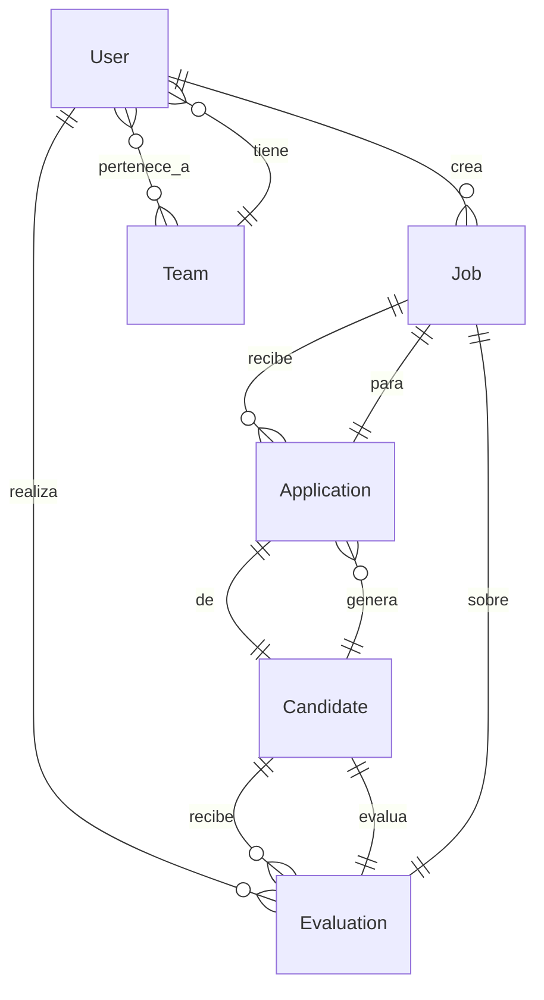

# LTI - Resumen del Producto

## Descripción General

**LTI** (Let's Track Intelligence) es una plataforma SaaS de nueva generación para la gestión del ciclo completo de atracción y selección de talento. Nace con el objetivo de rediseñar desde cero el concepto tradicional de ATS (Applicant Tracking System), integrando capacidades colaborativas en tiempo real y asistencia inteligente basada en IA para potenciar la toma de decisiones en reclutamiento.

## Propuesta de Valor

LTI permite a equipos de Recursos Humanos:

- Centralizar vacantes, candidatos y procesos en una sola interfaz.
- Colaborar en tiempo real con hiring managers, reclutadores y stakeholders.
- Automatizar tareas repetitivas como screening inicial, comunicación y seguimiento.
- Acceder a sugerencias de IA para optimizar decisiones y reducir tiempos de contratación.
- Aumentar la transparencia del pipeline y métricas con dashboards accionables.

## Ventajas Competitivas

| Característica                    | LTI | ATS Tradicionales |
|----------------------------------|-----|--------------------|
| Colaboración en tiempo real      | ✅  | ❌                  |
| IA para screening y sugerencias  | ✅  | ❌ Parcial          |
| Experiencia moderna y UX fluida  | ✅  | ❌                  |
| Personalización por equipo       | ✅  | ❌ Limitada         |
| Integraciones abiertas por API   | ✅  | ❌ Parcial          |

## Lean Canvas
### 📊 Lean Canvas [Lean Canvas](./diagramas/lean%20canvas.png)

<mxGraphModel dx="1480" dy="900" grid="1" gridSize="10" guides="1" tooltips="1" connect="1" arrows="1" fold="1" page="1" pageScale="1" pageWidth="1169" pageHeight="827">
  <root>
    <mxCell id="0"/>
    <mxCell id="1" parent="0"/>

    <!-- Fila superior -->
    <mxCell id="2" value="🔧 Problema&#xa;- Volumen de candidatos&#xa;- Screening manual&#xa;- Baja calidad" style="shape=swimlane;whiteSpace=wrap;rounded=1;fillColor=#ffe6e6;strokeColor=#d60000;verticalAlign=top;spacingTop=12;" vertex="1" parent="1">
      <mxGeometry x="20" y="20" width="160" height="150" as="geometry"/>
    </mxCell>

    <mxCell id="3" value="🎯 Segmentos Cliente&#xa;- Startups sin RRHH&#xa;- Equipos saturados" style="shape=swimlane;whiteSpace=wrap;rounded=1;fillColor=#e6f0ff;strokeColor=#005ce6;verticalAlign=top;spacingTop=12;" vertex="1" parent="1">
      <mxGeometry x="190" y="20" width="160" height="150" as="geometry"/>
    </mxCell>

    <mxCell id="4" value="🚀 Propuesta Única&#xa;ATS con IA que automatiza y mejora calidad de selección" style="shape=swimlane;whiteSpace=wrap;rounded=1;fillColor=#fff4cc;strokeColor=#b38f00;verticalAlign=top;spacingTop=12;" vertex="1" parent="1">
      <mxGeometry x="360" y="20" width="200" height="150" as="geometry"/>
    </mxCell>

    <mxCell id="5" value="💡 Solución&#xa;- IA CVs&#xa;- Chatbot entrevistas&#xa;- Ranking inteligente" style="shape=swimlane;whiteSpace=wrap;rounded=1;fillColor=#e6ffe6;strokeColor=#00a000;verticalAlign=top;spacingTop=12;" vertex="1" parent="1">
      <mxGeometry x="570" y="20" width="160" height="150" as="geometry"/>
    </mxCell>

    <mxCell id="6" value="🏆 Ventaja Injusta&#xa;- Algoritmos IA propios&#xa;- Dataset exclusivo" style="shape=swimlane;whiteSpace=wrap;rounded=1;fillColor=#f2f2f2;strokeColor=#808080;verticalAlign=top;spacingTop=12;" vertex="1" parent="1">
      <mxGeometry x="740" y="20" width="160" height="150" as="geometry"/>
    </mxCell>

    <!-- Fila media -->
    <mxCell id="7" value="📌 Alternativas Existentes&#xa;- Excel/email&#xa;- Notion&#xa;- ATS antiguos" style="shape=swimlane;whiteSpace=wrap;rounded=1;fillColor=#f0f8ff;strokeColor=#4682b4;verticalAlign=top;spacingTop=12;" vertex="1" parent="1">
      <mxGeometry x="20" y="180" width="160" height="130" as="geometry"/>
    </mxCell>

    <mxCell id="8" value="📊 Métricas Clave&#xa;- Clientes activos&#xa;- Candidatos procesados&#xa;- Retención" style="shape=swimlane;whiteSpace=wrap;rounded=1;fillColor=#f0fff0;strokeColor=#008000;verticalAlign=top;spacingTop=12;" vertex="1" parent="1">
      <mxGeometry x="190" y="180" width="160" height="130" as="geometry"/>
    </mxCell>

    <mxCell id="9" value="🌐 Concepto General&#xa;Plataforma de automatización con IA para reclutamiento" style="shape=swimlane;whiteSpace=wrap;rounded=1;fillColor=#fdf5e6;strokeColor=#e6ac00;verticalAlign=top;spacingTop=12;" vertex="1" parent="1">
      <mxGeometry x="360" y="180" width="200" height="130" as="geometry"/>
    </mxCell>

    <mxCell id="10" value="📢 Canales&#xa;- Ventas directas&#xa;- Marketing digital&#xa;- Referidos" style="shape=swimlane;whiteSpace=wrap;rounded=1;fillColor=#e0f7fa;strokeColor=#007c91;verticalAlign=top;spacingTop=12;" vertex="1" parent="1">
      <mxGeometry x="570" y="180" width="160" height="130" as="geometry"/>
    </mxCell>

    <mxCell id="11" value="👥 Primeros Adoptantes&#xa;- Empresas contratando&#xa;- Reclutadores con sobrecarga" style="shape=swimlane;whiteSpace=wrap;rounded=1;fillColor=#f3e5f5;strokeColor=#8e24aa;verticalAlign=top;spacingTop=12;" vertex="1" parent="1">
      <mxGeometry x="740" y="180" width="160" height="130" as="geometry"/>
    </mxCell>

    <!-- Fila inferior -->
    <mxCell id="12" value="💰 Estructura de Costos&#xa;- Infraestructura cloud&#xa;- Dev IA&#xa;- Soporte/Marketing" style="shape=swimlane;whiteSpace=wrap;rounded=1;fillColor=#fbe9e7;strokeColor=#d84315;verticalAlign=top;spacingTop=12;" vertex="1" parent="1">
      <mxGeometry x="190" y="330" width="280" height="110" as="geometry"/>
    </mxCell>

    <mxCell id="13" value="📈 Fuentes de Ingresos&#xa;- Suscripción mensual&#xa;- Pago por uso&#xa;- Servicios premium" style="shape=swimlane;whiteSpace=wrap;rounded=1;fillColor=#e8f5e9;strokeColor=#2e7d32;verticalAlign=top;spacingTop=12;" vertex="1" parent="1">
      <mxGeometry x="480" y="330" width="280" height="110" as="geometry"/>
    </mxCell>
  </root>
</mxGraphModel>   

# Caso de Uso 1 – Publicación y Gestión de Vacantes

## Descripción

Los reclutadores pueden crear, editar y publicar vacantes en múltiples canales desde una única interfaz centralizada. La plataforma permite controlar la visibilidad de la vacante, gestionar su estado (abierta, en pausa, cerrada) y recibir aplicaciones directamente dentro del sistema LTI.

## Actores

- **Reclutador:** Crea y gestiona vacantes.
- **Hiring Manager:** Puede revisar los detalles de la vacante antes de su publicación.
- **Sistema de Publicación Externa:** Plataformas como LinkedIn, Indeed o portales de empleo corporativos.

## Flujo Principal

1. El reclutador accede al módulo de creación de vacantes.
2. Ingresa información como título, descripción, requisitos y beneficios.
3. Selecciona los canales de publicación deseados.
4. El sistema publica automáticamente en las plataformas externas.
5. Los candidatos aplican desde los canales externos.
6. Las aplicaciones se centralizan automáticamente en LTI para su seguimiento.

## Diagrama de Flujo
### 📊 Caso de Uso 1 [Publicación y Gestión de Vacantes](./diagramas/1_caso_uso.png)

@startuml Caso de Uso 1 - Publicación y Gestión de Vacantes (Profundizado)

actor "Reclutador" as R
actor "Hiring Manager" as HM
participant "Sistema LTI" as LTI
participant "Canales Externos" as CE
actor "Candidatos" as C

R -> LTI: Accede al módulo de vacantes
R -> LTI: Crea nueva vacante
note right: Título, descripción, requisitos, beneficios

R -> HM: Solicita revisión de vacante
HM -> R: Aprueba o solicita cambios

alt Aprobada
    R -> LTI: Selecciona canales de publicación
    LTI -> CE: Publica automáticamente
    note right: LinkedIn, Indeed, portales corporativos
    
    C -> CE: Aplica desde canales externos
    CE -> LTI: Centraliza aplicaciones
    LTI -> R: Notifica nuevas aplicaciones
    R -> LTI: Gestiona aplicaciones recibidas
else Rechazada
    R -> LTI: Edita vacante según feedback
    R -> HM: Reenvía para aprobación
end

@enduml

# Caso de Uso 2 – Evaluación Colaborativa de Candidatos

## Descripción

LTI permite que reclutadores y hiring managers colaboren en tiempo real durante la evaluación de candidatos. A través de la plataforma, pueden intercambiar comentarios, calificaciones y observaciones directamente sobre el perfil del candidato, reduciendo la fricción y mejorando la toma de decisiones conjunta.

## Actores

- **Reclutador:** Filtra, organiza y comparte candidatos.
- **Hiring Manager:** Participa activamente en la evaluación de perfiles relevantes.
- **Sistema LTI:** Orquesta la interacción y registra todas las acciones colaborativas.

## Flujo Principal

1. El reclutador revisa nuevas aplicaciones recibidas desde canales externos.
2. Identifica candidatos potenciales y comparte sus perfiles dentro de LTI.
3. El hiring manager accede a los perfiles compartidos y deja comentarios, notas o puntuaciones.
4. El reclutador y el manager visualizan mutuamente sus aportes.
5. Se decide de manera colaborativa si el candidato avanza en el proceso o es descartado.

## Diagrama de Flujo
### 📊 Caso de Uso 2 [Evaluación Colaborativa de Candidatos](./diagramas/2_caso_uso.png)

@startuml Caso de Uso 2 - Evaluación Colaborativa (Profundizado)

actor "Reclutador" as R
actor "Hiring Manager" as HM
participant "Sistema LTI" as LTI
participant "Base de Candidatos" as BC

R -> LTI: Revisa nuevas aplicaciones
LTI -> R: Muestra lista de candidatos

R -> LTI: Filtra candidatos potenciales
R -> LTI: Comparte perfiles con HM
LTI -> HM: Notifica perfiles compartidos

HM -> LTI: Accede a perfiles compartidos
HM -> LTI: Agrega comentarios y puntuaciones
note right: Comentarios abiertos, calificaciones 1-5

R -> LTI: Visualiza aportes del HM
HM -> LTI: Visualiza aportes del reclutador

alt Decisión conjunta positiva
    R -> LTI: Avanza candidato en pipeline
    LTI -> BC: Actualiza estado del candidato
    LTI -> R: Notifica cambio de estado
    LTI -> HM: Notifica cambio de estado
else Decisión conjunta negativa
    R -> LTI: Rechaza candidato
    LTI -> BC: Actualiza estado del candidato
    LTI -> R: Notifica rechazo
    LTI -> HM: Notifica rechazo
end

@enduml

# Caso de Uso 3 – Automatización del Screening con IA

## Descripción

LTI incorpora un módulo de inteligencia artificial que analiza las aplicaciones recibidas y las evalúa automáticamente según criterios definidos por el equipo de reclutamiento. Esto permite reducir el tiempo dedicado al filtrado inicial de candidatos y enfocar el trabajo humano en las mejores oportunidades.

## Actores

- **Sistema de IA:** Procesa perfiles y aplica criterios de evaluación.
- **Reclutador:** Supervisa, valida y actúa en base a los resultados de IA.
- **Base de Candidatos:** Fuente dinámica de perfiles entrantes al sistema.

## Flujo Principal

1. El sistema de IA recibe nuevos perfiles desde fuentes internas y externas.
2. Se procesan los CVs y perfiles mediante técnicas de NLP y análisis semántico.
3. La IA asigna una puntuación a cada candidato según criterios como skills, experiencia, compatibilidad cultural y seniority.
4. Se genera una lista priorizada para revisión del reclutador.
5. El reclutador toma acción (avanzar, contactar, descartar).

## Diagrama de Flujo
### 📊 Caso de Uso 3 [Automatización del Screening con IA](./diagramas/3_caso_uso.png)

@startuml Caso de Uso 3 - Screening con IA (Profundizado)

participant "Sistema de IA" as AI
participant "Base de Datos" as DB
actor "Reclutador" as R
participant "Sistema LTI" as LTI

AI -> DB: Recibe nuevos perfiles
note right: Desde fuentes internas y externas

AI -> AI: Procesa CVs con NLP
note right: Análisis semántico, extracción de skills

AI -> AI: Aplica criterios de evaluación
note right: Skills, experiencia, compatibilidad cultural, seniority

AI -> AI: Asigna puntuación a cada candidato
note right: Algoritmo de scoring personalizado

AI -> LTI: Genera lista priorizada
LTI -> R: Muestra candidatos ordenados por puntuación

R -> LTI: Revisa resultados de IA
R -> LTI: Valida o ajusta puntuaciones

alt Candidato aprobado
    R -> LTI: Avanza candidato
    LTI -> DB: Actualiza estado
    LTI -> R: Notifica acción tomada
else Candidato rechazado
    R -> LTI: Rechaza candidato
    LTI -> DB: Actualiza estado
    LTI -> R: Notifica acción tomada
else Requiere revisión manual
    R -> LTI: Marca para revisión manual
    LTI -> DB: Actualiza estado
    LTI -> R: Notifica acción tomada
end

@enduml

# Modelo de Datos – LTI ATS

## Visión General

El modelo de datos de LTI está diseñado para soportar un flujo moderno y eficiente de reclutamiento colaborativo con automatización basada en IA. Incluye entidades clave que representan usuarios, vacantes, candidatos, evaluaciones y automatizaciones.

## Entidades Principales y Atributos

### 1. Usuario (`User`)
- `id`: UUID
- `nombre`: string
- `email`: string
- `rol`: enum (`reclutador`, `manager`, `admin`)
- `equipo_id`: UUID (FK)

### 2. Vacante (`Job`)
- `id`: UUID
- `titulo`: string
- `descripcion`: text
- `estado`: enum (`abierta`, `cerrada`, `pausada`)
- `ubicacion`: string
- `fecha_creacion`: datetime
- `creador_id`: UUID (FK → Usuario)

### 3. Candidato (`Candidate`)
- `id`: UUID
- `nombre`: string
- `email`: string
- `cv_url`: string
- `estado_pipeline`: enum (`nuevo`, `en evaluación`, `entrevista`, `oferta`, `descartado`)
- `fecha_aplicacion`: datetime

### 4. Postulación (`Application`)
- `id`: UUID
- `vacante_id`: UUID (FK)
- `candidato_id`: UUID (FK)
- `fuente`: enum (`linkedin`, `referido`, `sitio web`)
- `puntaje_ia`: float
- `fecha_postulacion`: datetime

### 5. Evaluación (`Evaluation`)
- `id`: UUID
- `evaluador_id`: UUID (FK → Usuario)
- `candidato_id`: UUID (FK)
- `vacante_id`: UUID (FK)
- `comentarios`: text
- `calificacion`: integer (1–5)
- `fecha`: datetime

### 6. Equipo (`Team`)
- `id`: UUID
- `nombre`: string
- `descripcion`: string

---

## Diagrama de Entidades y Relaciones
### 📊 Entidad Relacion [Entidad Relacion](./diagramas/entidad_relacion.png)

# Diseño del Sistema a Alto Nivel – LTI ATS

## Objetivo

Diseñar una arquitectura SaaS moderna para LTI que permita:

- Escalabilidad y modularidad
- Colaboración en tiempo real entre usuarios
- Integración con motores de IA y sistemas externos
- Seguridad y auditoría de operaciones
- API-first para integración con ecosistemas externos (Slack, LinkedIn, CRMs, etc.)

---

## Componentes Principales

- **Frontend Web (SPA):** React + Tailwind
- **API Gateway / BFF:** Capa de entrada centralizada
- **Backend de Servicios:** Vacantes, Candidatos, Evaluaciones, IA, Notificaciones, Auditoría
- **Motor de IA:** Screening automatizado, puntuación y recomendaciones
- **Base de Datos:** PostgreSQL, Redis, Almacenamiento de documentos
- **Capa en tiempo real:** WebSockets para colaboración live
- **Integraciones externas:** LinkedIn, Slack, Calendarios
- **Seguridad:** JWT/OAuth2, control de acceso granular y trazabilidad

---

## Diagrama de Arquitectura General
### 📊 Alto Nivel [Alto Nivel](./diagramas/alto_nivel.png)

@startuml LTI-Architecture-High-Level

!define RECTANGLE class

package "Frontend Layer" {
    [React SPA] as Frontend
}

package "API Gateway Layer" {
    [API Gateway / BFF] as Gateway
    [Load Balancer] as LB
}

package "Business Services Layer" {
    [Servicio de Vacantes] as Jobs
    [Servicio de Candidatos] as Candidates
    [Servicio de Evaluaciones] as Evaluations
    [Servicio de Usuarios] as Users
    [Servicio de Equipos] as Teams
    [Motor de IA / Screening] as AI
    [Servicio de Notificaciones] as Notifications
    [Servicio de Auditoría] as Audit
}

package "Data Layer" {
    database "PostgreSQL" as DB
    database "Redis Cache" as Cache
    database "File Storage" as Storage
}

package "Real-time Layer" {
    [WebSocket Server] as WS
}

package "External Integrations" {
    [LinkedIn API] as LinkedIn
    [Google Calendar] as Calendar
    [Slack / Email] as Communication
}

package "Infrastructure" {
    [Message Broker] as Broker
    [Monitoring] as Monitor
    [Security] as Security
}

' Conexiones principales
Frontend --> LB
LB --> Gateway
Gateway --> Jobs
Gateway --> Candidates
Gateway --> Evaluations
Gateway --> Users
Gateway --> Teams
Gateway --> AI
Gateway --> Notifications
Gateway --> Audit

' Conexiones a base de datos
Jobs --> DB
Candidates --> DB
Evaluations --> DB
Users --> DB
Teams --> DB
AI --> DB
AI --> Storage
Audit --> DB
Notifications --> Cache

' Tiempo real
Frontend --> WS
Candidates --> WS
Evaluations --> WS

' Integraciones externas
Jobs --> LinkedIn
Notifications --> Calendar
Notifications --> Communication

' Infraestructura
Jobs --> Broker
Candidates --> Broker
Evaluations --> Broker
AI --> Broker

@enduml

# Profundización Técnica – Servicio de Evaluaciones (C4 Nivel 3)

## Contexto

El Servicio de Evaluaciones es responsable de manejar la lógica de calificación, comentarios y seguimiento sobre los candidatos postulados a una vacante. Es clave para la colaboración entre reclutadores y hiring managers, ya que permite almacenar y consultar observaciones, puntajes y retroalimentación en tiempo real.

Este componente expone endpoints y eventos que interactúan con otros servicios como Candidatos, Vacantes, Usuarios y el módulo de Auditoría.

---

## Funciones Principales del Servicio

- Registrar evaluaciones sobre un candidato en una vacante
- Permitir múltiples evaluadores por candidato
- Soportar comentarios abiertos y puntuaciones cuantitativas
- Versionar cambios o ediciones en la evaluación
- Exponer API REST/GraphQL para UI y otros servicios
- Emitir eventos (`evaluation.created`, `evaluation.updated`)
- Sincronizar con el sistema de auditoría

## Diagrama C4 – Nivel 1: Contexto del Sistema
### 📊 Nivel 1 [Contexto del Sistema](./diagramas/c4_nivel_1.png)
@startuml LTI-C4-Level1-Context

!define RECTANGLE class

title LTI - Diagrama de Contexto del Sistema (C4 Nivel 1)

package "LTI - Let's Track Intelligence" {
    [LTI ATS Platform] as LTI
}

actor "Reclutador" as Recruiter
actor "Hiring Manager" as Manager
actor "Candidato" as Candidate

package "Sistemas Externos" {
    [LinkedIn] as LinkedIn
    [Indeed] as Indeed
    [Google Calendar] as Calendar
    [Slack] as Slack
    [Email System] as Email
}

Recruiter --> LTI : Gestiona vacantes y candidatos
Manager --> LTI : Evalúa candidatos colaborativamente
Candidate --> LTI : Aplica a vacantes

LTI --> LinkedIn : Publica vacantes
LTI --> Indeed : Publica vacantes
LTI --> Calendar : Programa entrevistas
LTI --> Slack : Notificaciones
LTI --> Email : Comunicaciones

@enduml
flowchart TB
    subgraph Servicio de Evaluaciones
        A1[EvaluationController] --> A2[EvaluationService]
        A2 --> A3[EvaluationRepository]
        A2 --> A4[EvaluationScoringEngine]
        A2 --> A5[CommentSanitizer]
        A2 --> A6[AuditEventEmitter]
    end

    subgraph Externos
        B1[Frontend Web React SPA]
        B2[Servicio de Vacantes]
        B3[Servicio de Candidatos]
        B4[Servicio de Auditoría]
    end

    B1 --> A1
    A3 --> B3
    A3 --> B2
    A6 --> B4

## Diagrama C4 – Nivel 2: Contenedores del Sistema
### 📊 Nivel 2 [Contenedores del Sistema](./diagramas/c4_nivel_2.png)
@startuml LTI-C4-Level2-Containers

!define RECTANGLE class

title LTI - Diagrama de Contenedores (C4 Nivel 2)

package "LTI ATS Platform" {
    [React SPA] as Frontend
    note right of Frontend : React + Tailwind\nProporciona funcionalidades de UI\npara gestión de vacantes y candidatos
    
    [API Gateway] as Gateway
    note right of Gateway : BFF (Backend for Frontend)\nManeja autenticación y routing
    
    [Servicio de Vacantes] as Jobs
    note right of Jobs : Gestiona creación, publicación\ny seguimiento de vacantes
    
    [Servicio de Candidatos] as Candidates
    note right of Candidates : Maneja perfiles, aplicaciones\ny pipeline de candidatos
    
    [Servicio de Evaluaciones] as Evaluations
    note right of Evaluations : Colaboración en tiempo real\nentre reclutadores y managers
    
    [Motor de IA] as AI
    note right of AI : Screening automatizado\ny puntuación de candidatos
    
    [Servicio de Notificaciones] as Notifications
    note right of Notifications : Envío de notificaciones\npor múltiples canales
    
    [Base de Datos] as Database
    note right of Database : PostgreSQL\nAlmacena datos principales
    
    [Cache] as Cache
    note right of Cache : Redis\nSesiones y datos temporales
    
    [WebSocket Server] as WS
    note right of WS : Comunicación en tiempo real\npara colaboración
}

actor "Reclutador" as Recruiter
actor "Hiring Manager" as Manager

package "Sistemas Externos" {
    [LinkedIn API] as LinkedIn
    [Google Calendar] as Calendar
    [Slack API] as Slack
}

' Conexiones principales
Recruiter --> Frontend : Usa
Manager --> Frontend : Usa

Frontend --> Gateway : API calls
Frontend --> WS : WebSocket

Gateway --> Jobs : HTTP/JSON
Gateway --> Candidates : HTTP/JSON
Gateway --> Evaluations : HTTP/JSON
Gateway --> AI : HTTP/JSON
Gateway --> Notifications : HTTP/JSON

Jobs --> Database : SQL
Candidates --> Database : SQL
Evaluations --> Database : SQL
AI --> Database : SQL
Notifications --> Cache : Redis

Jobs --> LinkedIn : REST API
Notifications --> Calendar : REST API
Notifications --> Slack : REST API

@enduml

## Diagrama C4 – Nivel 3: Componentes del Servicio de Evaluaciones
### 📊 Nivel 3 [Componentes del Servicio de Evaluaciones](./diagramas/c4_nivel_3.png)

@startuml LTI-C4-Level3-Evaluations

!define RECTANGLE class

title LTI - Servicio de Evaluaciones - Componentes (C4 Nivel 3)

package "Servicio de Evaluaciones" {
    [EvaluationController] as Controller
    note right of Controller : REST API endpoints\nValidación de entrada
    
    [EvaluationService] as Service
    note right of Service : Lógica de negocio\nOrquestación de operaciones
    
    [EvaluationRepository] as Repository
    note right of Repository : Acceso a datos\nCRUD operations
    
    [EvaluationScoringEngine] as Scoring
    note right of Scoring : Cálculo de puntuaciones\ny métricas
    
    [CommentSanitizer] as Sanitizer
    note right of Sanitizer : Limpieza y validación\nde comentarios
    
    [AuditEventEmitter] as Audit
    note right of Audit : Emisión de eventos\nde auditoría
    
    [RealTimeNotifier] as RTNotifier
    note right of RTNotifier : Notificaciones\nen tiempo real
}

package "Sistemas Externos" {
    [Frontend Web] as Frontend
    [Servicio de Vacantes] as Jobs
    [Servicio de Candidatos] as Candidates
    [Servicio de Auditoría] as AuditService
    [WebSocket Server] as WS
    [Base de Datos] as DB
}

' Conexiones internas
Controller --> Service : calls
Service --> Repository : data access
Service --> Scoring : calculate scores
Service --> Sanitizer : validate comments
Service --> Audit : emit events
Service --> RTNotifier : notify changes

' Conexiones externas
Frontend --> Controller : HTTP requests
Repository --> DB : SQL queries
Audit --> AuditService : events
RTNotifier --> WS : real-time updates

' Dependencias de datos
Repository --> Jobs : candidate/job validation
Repository --> Candidates : candidate data

@enduml

## Diagrama C4 – Nivel 4: Código del Componente EvaluationService
### 📊 Nivel 4 [Código del Componente EvaluationService](./diagramas/c4_nivel_4.png)

@startuml LTI-C4-Level4-EvaluationService

!define RECTANGLE class

title LTI - EvaluationService - Código (C4 Nivel 4)

package "EvaluationService" {
    class EvaluationService {
        +createEvaluation(evaluation: CreateEvaluationDto): Evaluation
        +updateEvaluation(id: UUID, updates: UpdateEvaluationDto): Evaluation
        +getEvaluationsByCandidate(candidateId: UUID): List<Evaluation>
        +getEvaluationsByJob(jobId: UUID): List<Evaluation>
        +calculateAverageScore(candidateId: UUID, jobId: UUID): float
        +notifyCollaborators(evaluation: Evaluation): void
    }
    
    class Evaluation {
        +id: UUID
        +evaluatorId: UUID
        +candidateId: UUID
        +jobId: UUID
        +comments: string
        +score: int
        +createdAt: DateTime
        +updatedAt: DateTime
    }
    
    class CreateEvaluationDto {
        +evaluatorId: UUID
        +candidateId: UUID
        +jobId: UUID
        +comments: string
        +score: int
    }
    
    class UpdateEvaluationDto {
        +comments?: string
        +score?: int
    }
    
    class EvaluationRepository {
        +save(evaluation: Evaluation): Evaluation
        +findById(id: UUID): Optional<Evaluation>
        +findByCandidateAndJob(candidateId: UUID, jobId: UUID): List<Evaluation>
        +update(id: UUID, evaluation: Evaluation): Evaluation
        +delete(id: UUID): void
    }
    
    class AuditEventEmitter {
        +emitEvaluationCreated(evaluation: Evaluation): void
        +emitEvaluationUpdated(evaluation: Evaluation): void
        +emitEvaluationDeleted(evaluationId: UUID): void
    }
}

package "Dependencias" {
    interface IEvaluationRepository
    interface IAuditEventEmitter
    interface IRealTimeNotifier
}

EvaluationService --> IEvaluationRepository : uses
EvaluationService --> IAuditEventEmitter : uses
EvaluationService --> IRealTimeNotifier : uses

EvaluationRepository ..|> IEvaluationRepository : implements
AuditEventEmitter ..|> IAuditEventEmitter : implements

@enduml